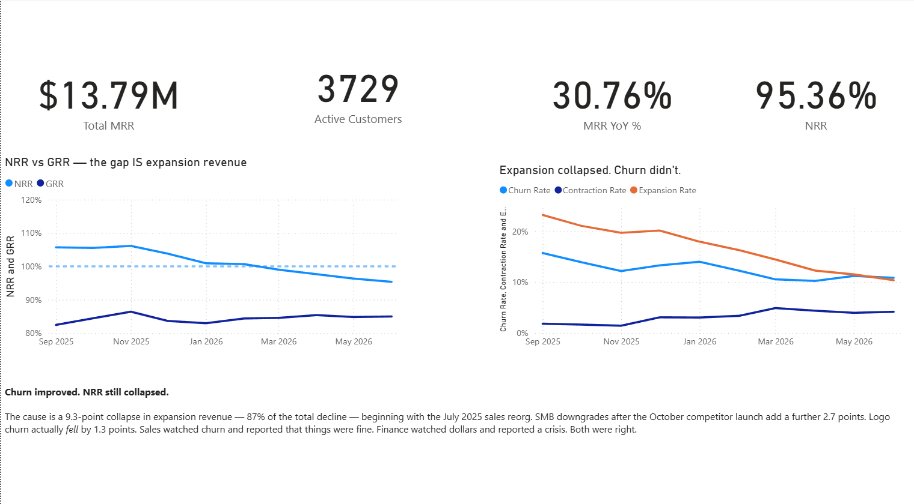

# Northwind Metrics — Revenue & Churn Diagnostic

[](https://github.com/vamkotss/northwind-revenue-diagnostic/actions/workflows/ci.yml)

**A B2B SaaS company's net revenue retention fell from 106% to 95% in three quarters. Three teams reported three different churn numbers. This repository finds out why — and proves it, to the cent.**

> **The finding: churn got *better*.**
>
> Logo churn improved by 1.3 points while NRR collapsed by 10.8. The damage was **expansion revenue dying** — 87% of the decline — after a sales reorganisation in July 2025. Sales watched churn and reported things were fine. Finance watched dollars and reported a crisis. **Both were right. Neither was watching the number that mattered.**



📄 **[Read the executive memo](reports/EXECUTIVE_MEMO.md)** — every number in it is generated from the pipeline, and each carries a tag mapping to the function that produced it and the test that guards it.

---

## Why this is not another portfolio project

| | |
|---|---|
| **The data is deliberately broken.** | Eight defect types injected by a seeded, tested generator — duplicate invoices with *fresh IDs*, timezone drift, retroactive corrections, orphaned records. I know exactly what's wrong with it, because I put it there. |
| **The metrics are governed, not assumed.** | Nine definitions and six edge-case rulings live in a [versioned contract](docs/metrics/metrics.yaml). The code *reads* it. Change `pause_grace_days: 60` to `90` and the churn number moves — because there is nowhere else for the code to get that number from. |
| **It reconciles to the ledger.** | Contracted MRR ties to billed revenue for **all 29 months. Largest unexplained residual: $0.00.** Not "small". Not "immaterial". Zero. |
| **The forecast is backtested.** | Walk-forward across 20 origins. Intervals derived from *measured* out-of-sample error, not model assumptions. It ships with a warning that it's degrading. |
| **One analysis refuses to answer.** | The pricing A/B test has a sample ratio mismatch and 4% contamination. The memo says so and recommends re-running it. Knowing when a result *cannot* be salvaged is the point. |

**144 tests. Green CI on every commit.**

---

## The three rulings that made the answer findable

Every one of these is a judgement call. Every one is defended with evidence in [`docs/metrics/metrics.yaml`](docs/metrics/metrics.yaml), including **what it cost us**.

**R1 — A paused subscription becomes churn after 60 days.**
Not chosen. *Derived.* Plotting return rate against pause length across 612 paused subscriptions: 89.6% of everyone who ever returns does so within 60 days, and beyond that the monthly return rate collapses below 2%. 60 days is where the elbow is.
*Cost: customers returning at 61–90 days get double-counted as a churn and a new logo. We accept that error because the alternatives are larger.*

**R2 — Usage add-ons are not MRR.**
"Recurring" means predictable. Add-ons swing 40% month to month. Folding them in would have made retention look healthy at exactly the moment it was collapsing, because a September price rise lifted add-on revenue 45% overnight.

**R3 — A downgrade is contraction, not churn.**
The customer still pays us and can be won back. Counting it as churn would have buried the *second-largest* driver of the decline inside a number nobody could act on.

---

## Where the 10.8 points went

| Driver | Was | Now | NRR impact | Share |
|---|---|---|---|---|
| **Expansion (upsell)** | 19.7% | 10.4% | **−9.3 pts** | **87%** |
| Contraction (downgrades) | 1.4% | 4.2% | −2.7 pts | 25% |
| Churn (customers who left) | 12.2% | 10.8% | **+1.3 pts** | −12% |
| **Total** | | | **−10.7 pts** | **100%** |

**No residual, by construction.** NRR is an identity — `1 − churn − contraction + expansion` — so the change in NRR is *exactly* the sum of the changes in its parts. Nothing to argue about.

---

## The pipeline

```
generate.py    →  1.7M rows of realistic SaaS data + 8 injected defects  (seeded, byte-identical every run)
clean.py       →  implements rulings R1/R5/R6 · quarantines nothing silently · full audit trail
reconcile.py   →  ties subscriptions to the billing ledger · residual must be $0.00
decompose.py   →  splits the NRR decline into churn / contraction / expansion
experiment.py  →  detects the SRM, refuses to read out a broken experiment
forecast.py    →  walk-forward backtest · bias correction · regime-change detection
export.py      →  Power BI star schema · semi-additive measures
memo.py        →  writes the executive memo · every number computed, none typed
```

Each module cites the ruling it implements. Each ruling cites the evidence behind it.

---

## Three things that would have gone silently wrong

**Half the duplicate invoices carried *new* IDs.**
`drop_duplicates(subset=["invoice_id"])` catches the other half, reports a plausible number, and leaves **$596,000 of double-counted revenue** in the total. The only safe key is the business key.

**154 invoices point at customers who don't exist.**
A `LEFT JOIN` erases them silently. Revenue comes out $536,506 low, nothing errors, and you present a wrong number with total confidence. They're **quarantined, not dropped** — because the reconciliation is impossible unless every unattributable dollar is on the books somewhere.

**The winning forecast model's bias flipped sign.**
Drift won the backtest with a 4.4% MAPE — which looks superb. But that average was earned across eighteen months of 40%-a-quarter growth, and we're forecasting from a quarter that grew 6%. Its bias has gone from −$832k to **+$730k**. It's still the best model available, and it is **actively getting worse**. The memo says so.

---

## Run it

```bash
python -m venv .venv
.\.venv\Scripts\Activate.ps1        # Windows
python -m pip install -r requirements.txt

$env:PYTHONPATH = "src"

python -m northwind.generate --out data/raw
python -m northwind.clean --raw data/raw --out data/processed
python -m northwind.reconcile
python -m northwind.decompose
python -m northwind.experiment
python -m northwind.forecast
python -m northwind.export
python -m northwind.memo

python -m pytest tests/ -v          # 144 tests
```

The generator is seeded. **Your output will be byte-identical to mine.**

---

## Layout

| Path | |
|---|---|
| [`docs/metrics/metrics.yaml`](docs/metrics/metrics.yaml) | **The metrics contract.** Nine definitions, six rulings, evidence for each. |
| [`docs/adr/`](docs/adr/) | Architecture decisions — why DuckDB, and what it cost. |
| [`docs/powerbi/BUILD.md`](docs/powerbi/BUILD.md) | Dashboard build guide, including the semi-additive trap that breaks most SaaS dashboards. |
| [`reports/EXECUTIVE_MEMO.md`](reports/EXECUTIVE_MEMO.md) | **The deliverable.** Generated, not written. |
| `src/northwind/` | The pipeline. |
| `tests/` | 144 tests. They run on every push. |

---

## Stack

Python 3.13 · pandas · DuckDB · numpy · scipy · pytest · ruff · GitHub Actions · Power BI

---

## Author

**Sri Vamsi Kota** — MS Business Analytics & AI, UT Dallas
[github.com/vamkotss](https://github.com/vamkotss)
